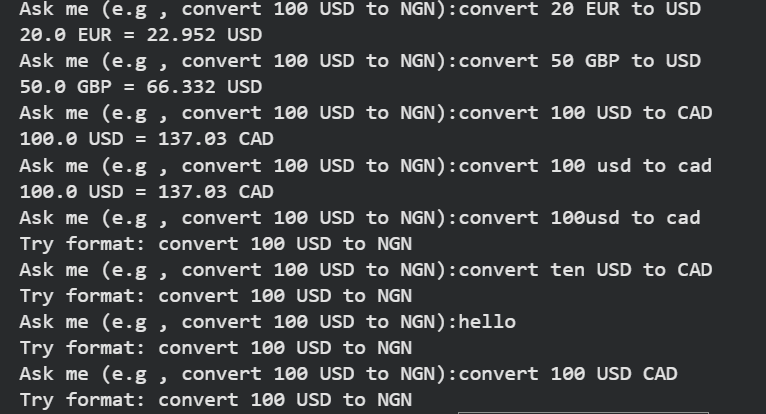

# Accuracy Test Report

## Project Title
Real-Time Currency Converter Chatbot

## Objective
To test the chatbot's accuracy in handling currency conversion requests and invalid inputs.

## Test Cases
| Test Case ID | Input                  | Expected Result                                             | Actual Result                      | Status | Comments                                  |
| ------------ | ---------------------- | ----------------------------------------------------------- | ---------------------------------- | ------ | ----------------------------------------- |
| TC01         | convert 20 EUR to USD  | Chatbot should return the correct USD equivalent of 20 EUR  | 20.0 EUR = 22.952 USD              | Pass   | Correct conversion                        |
| TC02         | convert 50 GBP to USD  | Chatbot should return the correct USD equivalent of 50 GBP  | 50.0 GBP = 66.332 USD              | Pass   | Correct conversion                        |
| TC03         | convert 100 USD to CAD | Chatbot should return the correct CAD equivalent of 100 USD | 100.0 USD = 137.03 CAD             | Pass   | Correct conversion                        |
| TC04         | convert 100 usd to cad | Chatbot should still work with lowercase currency codes     | 100.0 USD = 137.03 CAD             | Pass   | Case-insensitive handling works           |
| TC05         | convert 100usd to cad  | Chatbot should reject incorrect format                      | Try format: convert 100 USD to NGN | Pass   | Missing space between amount and currency |
| TC06         | convert ten USD to CAD | Chatbot should reject invalid amount format                 | Try format: convert 100 USD to NGN | Pass   | Non-numeric amount                        |
| TC07         | hello                  | Chatbot should reject unrelated input                       | Try format: convert 100 USD to NGN | Pass   | Invalid query handled                     |
| TC08         | convert 100 USD CAD    | Chatbot should reject incorrect format                      | Try format: convert 100 USD to NGN | Pass   | Missing "to" keyword                      |

## Chatbot Test Results

The screenshot below shows the chatbot responses for several test cases.

